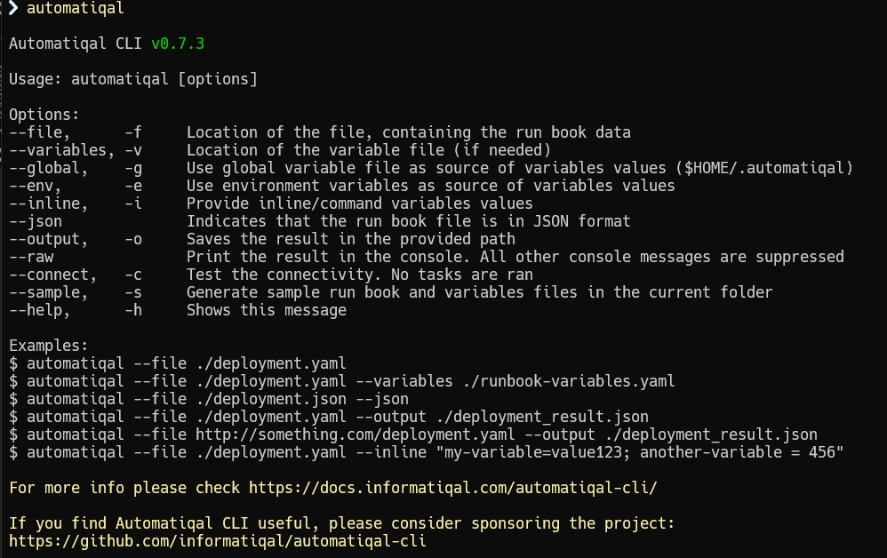
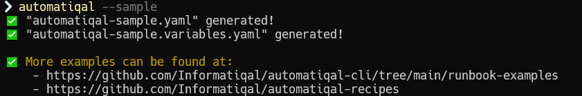

# Automatiqal CLI

## What it is

`Automatiqal CLI` is the CLI wrapper around the `Automatiqal` package.

It allows automating Qlik Sense (QSEoW) administration/deployment tasks by describing them in yaml/json files.

## Demo and screenshots

### Commands

After installing `Automatiqal CLI` the list of available commands can be show by just starting `automatiqal` without any arguments or by using the `help` flag (`automatiqal --help`)

Writing runbooks

The easiest way to start writing runbooks is to invoke the `sample` command. This command will generate a sample runbook and variables files in the **current folder**:

`automatiqal --sample`

Automatiqal CLI introduction video

<iframe
    width="640"
    height="480"
    src="https://www.youtube.com/embed/ZU13H9uw1lM"
    frameborder="0"
    allow="autoplay; encrypted-media"
    allowfullscreen
    referrerpolicy="no-referrer-when-downgrade"
>
</iframe>
