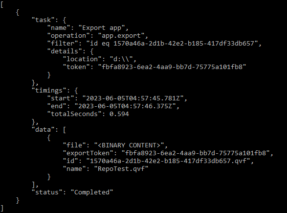

# Outputs

Two output related flags are available:

## Output

When this flag is used the raw output will be saved as json format in the provided file name:

`--output some-file-name.json`

## Raw

If this flag is used then the raw output will be displayed directly in the terminal.

All other terminal outputs will be suspended!

`--raw`

!!! note "Sensitive data"

    Sensitive data (such as data connection passwords) will be masked

!!! note "Binary data"

    Binary data (such as upload/export app) will be replaced with message placeholder

## Example

