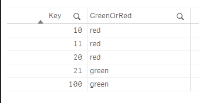

# Basic usage

```javascript
import * as q from "@informatiqal/qlik-sse";

// create an instance of the server
const s = q.server({
  identifier: "myPlugin",
  version: "0.0.1",
});


// function to handle the data request
function greenOrRed(request) {
  request.on("data", (bundle) => {
    // since our function is defined to return string ->
    //   returnType: q.sse.DataType.STRING
    // we have to return strData property
    const rows = bundle.rows.map((row) => {
      return {
        duals: [
          {
            strData: row.duals[0].numData > 20 ? "green" : "red",
          },
        ],
      };
    });

    request.write({ rows });
  });
}

// register functions with SSE
s.addFunction(greenOrRed, {
  functionType: q.sse.FunctionType.SCALAR,
  returnType: q.sse.DataType.STRING,
  name: "color",
  params: [
    {
      name: "first",
      dataType: q.sse.DataType.NUMERIC,
    },
  ],
});

// start the server
s.start({
  port: 50051,
  allowScript: true,
});
```

Once the server is started then in the script editor we'll be able to use new function - `myPlugin.color`

```sql
LOAD
  Key,
  myPlugin.color(Num(Key)) as GreenOrRed,
;
Load * Inline [
Key
10
11
20
21
100
];
```

The table above will load 4 rows. For each value in the `Key` field will call the SSE server by passing the current value. The SSE server will then run `greenOrRed` JS function and based on the value will return the result - if the value is < 20 then the response is `red` and if the value is > 20 then the response will be `green`.

Once the app is reloaded the result will be:


