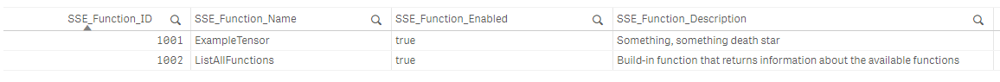

# Build-in functions

The package expose one (for now) build-in function. The default behavior is to load all of these functions. In order to disable them from loading just pass `disableBuildIn: false` when configuring the server:

```js
const s = q.server({
  identifier: "MySSEFunctions",
  version: "0.1.0",
  disableBuildIn: false
});
```

## Build-in functions

- `ListAllFunctions` - get info about the registered functions (id, name, is enabled and description) from within Qlik load script.

    In order to use it:

    ```qlik
    // unfortunately we'll need this temp table
    Temp:
    Load RowNo() AutoGenerate(1);

    SSEFunctionsList:
    Load * Extension QCB.ListAllFunctions(Temp);

    Drop Table Temp;
    ```

    And the result:
    

    !!!note

        It is possible to load set of fields:

        ```qlik
        Load 
            SSE_Function_ID as FunctionID,
            SSE_Function_Name as FunctionName,
        Extension QCB.ListAllFunctions(Temp);
        ```
