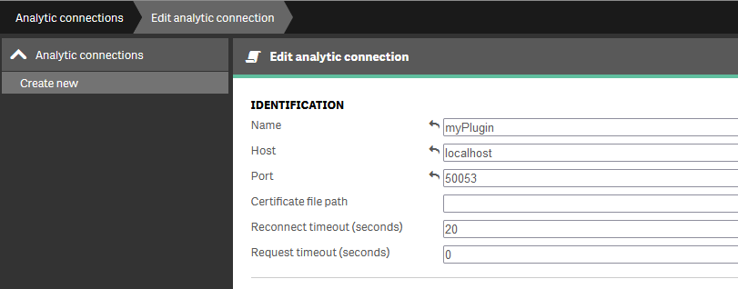

# Qlik Setup

## Qlik Sense

### Desktop

- We'll have to edit `settings.ini` file and add our SSE plugin(s) information. The ini file path is:

    `C:\Users\<USER>\Documents\Qlik\Sense\Settings.ini`

- Under `[Settings 7]` the should be `SSEPlugin` row.

    !!! note

        If do not exists then create it.

    - In there we can specify the prefix, host and port for our plugin. The prefix will be used inside Qlik itself.

        ```bash
        SSEPlugin=myPlugin,localhost:50053
        ```

        To add multiple plugins:

        ```bash
        SSEPlugin=myPlugin,localhost:50053;myOtherPlugin,localhost:60053
        ```

        To use certificates we have to provide the path to where the certificates are stored:

        ```bash
        SSEPlugin=myPlugin,localhost:50053,c:/path/to/folder/with/certificates
        ```

### Server

- Head to QMC -> Analytic connection section
- press `Create new` button
- And fill the required fields
    - name - the plugin identification (how to be access from the script)
    - host - the host where the connection is running
    - port - the port on which the connection is listening
    - Certificate path - if the connection is utilizing SSL then fill this with the path to where the Engine can access the certificates

        

    !!!note

        For my instance QS was looking the certificates on `c:\` and was ignoring whatever path was specified in the field

    !!!note

        Make sure that the certificate domain matches the `Host` value

    !!!note

        For any issues please check the Engine logs `C:\ProgramData\Qlik\Sense\Log\Engine\Trace\<HOST>_SSE_Engine.txt`

## QlikView

### Desktop

Similar with `Qlik Sense Desktop` above but the path to the `ini` file is:

 `C:\Users\<USER>\AppData\Roaming\QlikTech\QlikView\Settings.ini`

### Server

TBA
