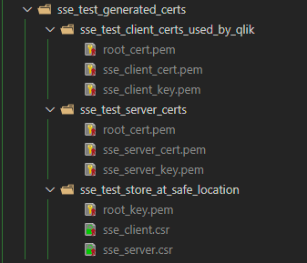

# SSL

By default `@informatiqal/qlik-sse` will create insecure server. In order to create secure connection we'll have to provide se tof certificates, which will be used by the server and the client.

## Generating certificates

The official Qlik SSE repository contains the necessary files and instructions of how to create self-signed certificates.

The same files are available in `@informatiqal/qlik-sse` package as well.

### Files

- `sse_client_config.txt` - edit the `alt_names` section to specify list of hosts/ip that will be included in the certificate
- `sse_server_config.txt` - nothing to edit here. Used to generate the client certificates
- `generate_sse_certs.bat` - run this file to generate the actual certificates. Run `generate_sse_certs.bat <name>`. `<name>` can be anything. This argument will be used to create folder where the certificates will be stored
- `generate_sse_certs.sh` - same as `generate_sse_certs.bat` but for Linux operating systems

### Set of certificates

If we run `generate_sse_certs.bat test` the following folders and files will be available:

Check out [QS Setup](qs-setup.md) section for information how to setup QS to use these certificates

!!!warning

    Qlik expects the certificates to have exactly these names:

    - root.pem
    - sse_client_cert.pem
    - sse_client_key.pem
